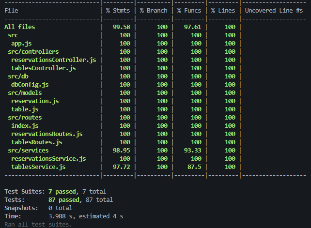

# 🍕 Restaurant reservation API

## Visão Geral

Este projeto é uma API REST Node.JS desenvolvida com Express para prática de testes unitários e de integração com Jest e Supertest. 
A API implementa um CRUD completo e simula o sistema de reservas de mesas de um restaurante.

---

## Tecnologias Utilizadas

* Node.js
* Express
* Knex.js
* SQLite
* Jest
* Supertest

---

## Estrutura do Projeto

```
📦 Restaurant-reservation-API
 ┣ 📁 src
 ┃ ┣ controllers
 ┃ ┣ services
 ┃ ┣ models
 ┃ ┣ database
 ┃ ┗ app.js
 ┣ 📁 assets     
 ┣ 📁 tests
 ┣ README.md
 ┗ package.json
```

---

## Configuração e Instalação

### Clonar o repositório

```
git clone <url-do-repo>
cd projeto
```

### Instalar dependências

```
npm install
```

### Criar o banco de dados SQLite

Rode o script de população:

```
npm run populate
```

Esse script executa o arquivo `populate.sql`, criando as tabelas e inserindo dados iniciais.

### Rodar a aplicação

```
npm run dev
```

A API estará disponível em:

```
http://localhost:3000
```

---

## Rotas da API

### Rotas de **Tables**

#### 🔹 GET /tables

Retorna todas as mesas cadastradas.

#### 🔹 GET /tables?date=YYYY-MM-DD

retorna apenas mesas disponíveis naquela data (verifica reservas do dia)

#### 🔹 GET /tables/:id

Retorna uma mesa específica por ID.

#### 🔹 POST /tables

Cria uma nova mesa.
Exemplo de corpo:

```json
{
  "seats": 4,
  "active": true
}
```

🔹 PATCH /tables/:id

Ativa/desativa uma mesa.

#### 🔹 DELETE /tables/:id

Remove uma mesa.

---

### Rotas de **Reservations**

#### 🔹 GET /reservations

Retorna todas as reservas.

#### 🔹 GET /reservations?date=YYYY-MM-DD

Filtra reservas por data.

#### 🔹 GET /reservations/:id

Retorna uma reserva específica por ID.

#### 🔹 POST /reservations

Cria uma nova reserva.
Exemplo de corpo:

```json
{
  "table_id": 1,
  "costumer_name": "Antônio",
  "date_time": "2025-11-13 19:00"
}
```

#### 🔹 DELETE /reservations/:id

Remove uma reserva.

---

## Regras de Negócio

* Não é permitido criar uma reserva para um **horário já ocupado**.
* A mesa deve existir.
* A mesa deve estar ativa.
* A data deve estar no formato **YYYY-MM-DD HH:mm**.

---

## Testes Automatizados

### Rodar todos os testes:

```
npm test
```

Os testes incluem:

* Testes unitários dos services com mocks
* Testes de integração das rotas usando Supertest
* Validações de erros

---

## Cobertura de Testes



Para rodar a cobertura de testes use o comando
```
npm run test:coverage
```

---

## ✨ Autor

Antônio Sousa.

---

## 📃 Licença

Este projeto é de uso livre para fins de estudo e aprendizado.
